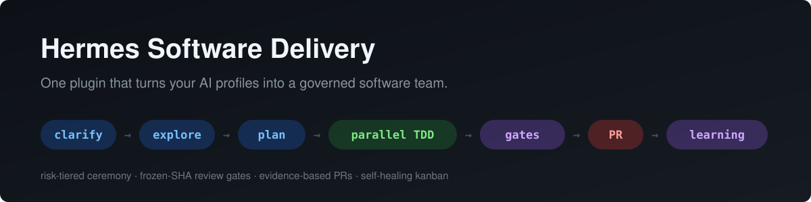

<p align="center">
  
</p>

# Hermes Software Delivery

**A structured software-delivery workflow for [Hermes Agent](https://github.com/NousResearch/hermes-agent) — shipped as one plugin.** Point it at your existing AI profiles and get a governed development team: issues are clarified, planned, implemented with TDD in parallel worktrees, independently reviewed on frozen commits, and delivered as evidence-backed pull requests — without you manually testing or reviewing each change.

[](#-quickstart)
[](LICENSE)
[](https://github.com/NousResearch/hermes-agent)
[](#-bring-your-own-bots)

---

## What this workflow solves

AI teams move fast; trusting what they ship is the hard part. This workflow turns every delivery claim into something you can verify:

| You get | How it works |
|---|---|
| Parallelism you can trust | Wave plans are computed from the engine's live concurrency caps — what's promised is what runs |
| TDD by construction | RED evidence is required *before* implementation; mutation checks prove the tests bite |
| Reviews that can't drift | Gates review a frozen SHA; any base or head movement invalidates prior evidence |
| `done` means proven | Acceptance criteria are re-run independently by the Verifier role on the frozen state |
| One source of truth | Skills deploy as symlinks from a single git-versioned repo — identical across every profile by construction |
| A board that runs itself | A deterministic supervisor keeps queues flowing, reclaims dead claims, and routes decisions to the coordinator |

The result: **you review evidence, not code.**

## The flow

```
issue ──► clarify ──► explore ──► plan ──► parallel TDD ──► refactor ──► gates ──► PR ──► learning
        intake brief   surfaces    frozen     instances in     SIMP        frozen-SHA   evidence   weekly digest
        + risk tier    artifact    interfaces worktrees,       findings    review,      block +    + standards
                                  hash-locked RED→GREEN        → own card  QA, security  approvals  loop
```

### Stages

| # | Stage | What happens | Required artifact | Gate to pass |
|---|---|---|---|---|
| 1 | **Clarify** | Issue becomes a brief: problem, acceptance criteria, non-goals, risk tier (LOW/MED/HIGH) | Intake brief | Brief complete — no routing on assumptions |
| 2 | **Explore** | Blast-radius investigation: affected files, modules, contract surfaces | SURFACES section | Declared surfaces match reality |
| 3 | **Plan** | Implementation plan with frozen interfaces, SHA256-locked to the card | Plan file + hash (MED/HIGH) | Plan locked; amendments supersede |
| 4 | **Parallel TDD** | Implementer instances in per-issue worktrees: RED → IMPLEMENTING → GREEN → REGRESSION | RED line before implementation | RED evidence exists |
| 5 | **Refactor** | Simplification findings become their own card — never mixed with behavior | Separate simplify card | Zero behavior change |
| 6 | **Gates** | Independent review of the frozen SHA: diff review, criteria re-run, security when triggered | Complete evidence block | Most severe verdict wins |
| 7 | **PR** | Draft PR generated from verified evidence; approvals batched per wave | PR with evidence block | Your one `ship N / hold N` reply |
| 8 | **Learning** | Weekly digest: flow metrics, gate effectiveness, finding classes → standards amendments | Weekly digest | You approve drafts only |

### Risk-tiered ceremony

Not every change earns the same process. The intake tier decides:

| | LOW | MED | HIGH |
|---|---|---|---|
| Trigger | ≤2 files, no contract change, existing coverage | behavior or UI change | schema/API/security boundary |
| Plan | inline mini-plan | file + SHA lock | + adversarial interrogation |
| Review | same-card reviewer (one-shot) | dispatched review | reviewer + QA + security in parallel |
| Independent criteria re-run | implementer's block + diff check | QA re-runs criteria | + mutation check |

LOW cards — the majority of small issues — touch ~3 roles in ~2 sessions.

## The concepts behind it

This isn't a pile of prompts — it's several established engineering paradigms composed into one delivery system. Knowing the vocabulary makes it easier to adopt, adapt, and trust:

| Concept | How it shows up here |
|---|---|
| **Orchestrator–worker architecture** | A coordinator role is the control plane: it routes, reconciles, and reports — never implements. Workers are disposable instances of role profiles, spawned per card by the engine dispatcher. |
| **Task-graph (DAG) engineering** | Work is decomposed into dependency-aware task nodes (`references/task-graph-flow.md`). Ready nodes execute in parallel waves; integration happens before gates, so reviews see integrated reality, not divergent branches. |
| **Loop engineering (closed feedback loops)** | Four nested loops: the RED→GREEN TDD loop inside a card; the implement→review→rework loop bounded by gates across cards; the supervisor's sense→act loop every 15 minutes; and the weekly learning loop that turns repeated findings into standards. |
| **Autonomic operation** | A deterministic supervisor keeps the board healthy on its own schedule — reclaims dead claims, refreshes queues, and routes cards that need a decision to the coordinator. |
| **Evidence-based gating (fail-closed)** | Nothing passes without machine-verifiable evidence: criteria re-run independently, frozen-SHA review, hash-locked plans, mutation checks. Missing evidence is a blocker, never a pass. |
| **Risk-tiered adaptive ceremony** | Process weight scales with blast radius — LOW/MED/HIGH tiers decided at intake from the brief's own fields, so small changes move fast and dangerous ones earn full scrutiny. |
| **Pipelined parallelism** | Reviews of one wave overlap implementation of the next; same-module cards batch into one session to amortize boot cost. Parallelism comes from *instantiation* of roles, not from more bots. |
| **Pull system with WIP limits (Kanban)** | Per-profile concurrency caps, queue signals, and wave plans computed from live engine caps — never from wishful policy numbers. |
| **Deterministic-first / policy as code** | Anything expressible as a script runs without an LLM (validators, metrics, mutation checks, housekeeping); config assertions fail loudly on drift; declarative policy mirrors are validated against engine reality. |
| **Role-based least authority** | Authority ceilings attach to roles and cards; no skill, card, or model can expand them. Human approval gates (merge, deploy, credentials...) are structural, not conventional. |
| **Single-source-of-truth deployment** | The whole workflow is git-versioned and deployed idempotently — skills are symlinks, so drift across profiles is structurally impossible and `git pull && ./install.sh` is the only update path. |

## 🚀 Quickstart

Requires a working [Hermes Agent](https://hermes-agent.nousresearch.com/docs/) install with at least one profile (bot).

```sh
bash <(curl -fsSL https://raw.githubusercontent.com/chryzxc/hermes-software-delivery/main/bootstrap.sh)
```

Answer **5 questions** mapping roles to your profiles (Enter accepts defaults; the rest auto-alias). Prefer flags?

```sh
git clone https://github.com/chryzxc/hermes-software-delivery.git
cd hermes-software-delivery
./install.sh --roster coordinator=default implementer=forge reviewer=sentry verifier=sentinel security_reviewer=cypher
```

Updating: `git pull && ./install.sh` — idempotent, one step, updates skills, scripts, cron, and the plugin everywhere.

## 🤖 Bring your own bots

This repo contains **no bot names** — it ships the workflow, not a roster. Every participant is a role (Coordinator, Implementer, Reviewer, Verifier, Security Reviewer, Planner, Researcher, Designer, Release Engineer, Spike Explorer, Security Tester, Auditor, Administrator). Map them to any Hermes profiles in `~/.hermes/roster.yaml`:

```yaml
roles:
  coordinator: default      # your main agent
  implementer: my-coder     # any name you use
  reviewer: my-reviewer
  # ... 5 required, 8 optional (auto-aliased)
```

Works with 3 profiles or 13. Different team setups adopt the same workflow without touching it.

## What's inside

```
├── plugin.yaml                  # native Hermes plugin manifest (v2)
├── software_delivery/           # plugin: 3 agent tools + doctor CLI + metrics hook
├── workflow/
│   ├── skills/                  # orchestrator policy skill + evidence/ADR/standards skills
│   ├── scripts/                 # board supervisor scan, warm-build, housekeeping, intelligence...
│   ├── cron.jobs.json           # 6 cron jobs: board supervisor, watchers, digests
│   ├── config.assertions.yaml   # engine caps this workflow expects
│   └── roster.example.yaml      # role → profile mapping template
└── install.sh                   # idempotent installer (bootstrap.sh = one-liner)
```

## Plugin tools (agent-callable, deterministic — zero LLM tokens)

- `delivery_check_policy` — validates engine caps vs policy, roster integrity, open-card requirements
- `delivery_board_intelligence` — per-stage wall-clock, queue waits, gate rejection rates, rework loops
- `delivery_mutation_check` — flips one condition in a disposable worktree and requires the focused test to fail

Plus `hermes software-delivery` doctor CLI and an `on_session_end` metrics hook (append-only JSONL).

## The learning loop

The weekly digest reports per-stage wall-clock, queue waits, gate rejection rates, and finding classes. Any review finding class appearing 3+ times auto-drafts an amendment to the engineering-standards skill — **the workflow writes its own rulebook**. A gate silent for two weeks is flagged fix-or-remove.

## Safety model

- The three plugin tools are read-only: they report facts and evidence
- The board supervisor is the only writer inside Hermes state, and only to Kanban cards and profile skill installs; repositories remain untouched
- Human approval gates are unchanged and always yours: merge, deploy, production, credentials, purchases, publishing, irreversible deletion
- `delivery_mutation_check` mutates only a disposable git worktree file and restores it
- The engine install (`~/.hermes/hermes-agent`) is never modified — everything lives in the user-state layer and survives `hermes update`

## FAQ

**Does it work with fewer than 13 profiles?** Yes — 5 required roles, the rest alias automatically. Even 3 profiles work (roles share profiles).

**Will `hermes update` remove it?** No. Everything installs into the Hermes user-state layer; the updater only touches the engine checkout. Run `./install.sh` after an update to re-assert everything.

**Does it cost more tokens?** Less, usually: tiering skips the plan session and QA reproduction for low-risk work, reviews batch multiple commits per session, and every check expressible as a script runs without an LLM.

**Can I use it on multiple machines?** Clone, `./install.sh`, done — same workflow everywhere.

**Is there a CI badge?** The repo runs its plugin tests with pytest (`tests/`); CI integration is welcome as a contribution.

## Contributing

Issues and PRs welcome. Run the tests before submitting:

```sh
uv venv && uv pip install --python .venv "pytest>=8,<9"
.venv/bin/python -m pytest -q
```

## License

[MIT](LICENSE) © 2026 Christian Rey Villablanca
